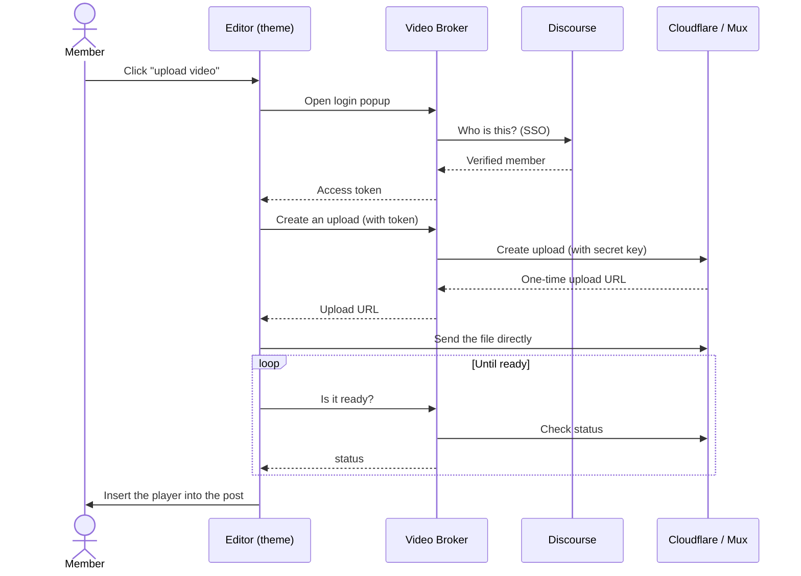

# CF Discourse Video Broker

A small [Cloudflare Worker](https://workers.cloudflare.com/) that lets your Discourse members upload videos straight to **Cloudflare Stream** or **Mux**.

It is the backend companion to the **[Discourse Video Publisher](https://github.com/arkshine/discourse-video-upload)** theme component (as opposed to a full plugin). This Worker handles login and talks to Cloudflare/Mux on the user's behalf.

[](https://deploy.workers.cloudflare.com/?url=https://github.com/arkshine/cf-discourse-video-broker)

## Why a broker?

Cloudflare Stream and Mux use one account-wide credential. Putting that key in a theme component (which every visitor can read) would let anyone use your account. So a tiny middleman sits in between:

- It **logs the user in** through your Discourse site (Discourse SSO).
- It **keeps the secret keys** safe on Cloudflare's servers.
- It **creates the upload** and hands the browser a one-time link.
- The **video bytes go straight from the browser to Cloudflare/Mux**.

You host this Worker. It is cheap to run (Cloudflare's free tier is usually enough for the broker itself; you pay Cloudflare Stream or Mux for the actual video hosting).

> This is an alternative to using a Discourse plugin.<br>This should be used only if you want to keep Theme component flexibility or you can't install a plugin on your instance.

> Discourse has a great plugin using Mux and with better integration: https://github.com/discourse/discourse-video.<br>
> If you are hosted by Discourse and looking for more space, they offer extra storage -- I encourage your to contact them!

### How it works



## What you'll need

- A **Cloudflare account** (free is fine for the Worker).
- A **Cloudflare Stream** subscription **and/or** a **Mux** account — whichever provider(s) you want to offer.
- A Github/Gitlab account
- **Admin access** to your Discourse site.
- About **5~10 minutes**.

## Setup

### Configure SSO on Discourse

In Discourse: **Admin → Settings**:

1. Turn on **`enable discourse connect provider`**.
2. In **`discourse connect provider secrets`**, add one line with the symbol `*` and a secret.

> Later, you can change `*` with your Cloudflare worker URL, if you want.

### Deploy the Worker

Click the **Deploy to Cloudflare** button at the top. Cloudflare will open a pre-filled page with settings.<br>
You must:

- Select a Git account (the repository will be cloned there)
- Fill `DISCOURSE_CONNECT_SECRET` (value from Discourse's `discourse connect provider secrets` setting)
- Fill `DISCOURSE_ORIGIN` (your forum url)

Click **deploy**.

Wait until it finishes build and deploy.

### Add provider variables

Next, depending on the provider(s) you want to use, you'll need to add the following variables.

To do so, go to your Worker dashboard → Settings → Variables and secret → click **Add a variable** button.

> Use **Text** type for variables that are not secrets.<br>
> Use **Secret** type for secret keys.

**Cloudflare Stream**

1. Create a Cloudflare Stream subscription
2. Copy the account ID from the Overview page to the `CLOUDFLARE_ACCOUNT_ID` variable.
3. Go to API Tokens (https://dash.cloudflare.com/profile/api-tokens) and create new token:
   - Select Custom token
   - Choose **Stream** with **Edit** permission
   - Copy the token value and paste it to `CLOUDFLARE_STREAM_TOKEN` secret variable.

**Mux**

1. Create a Mux account
2. Go to Mux Dashboard -> Settings -> Access Tokens
3. Create a new token **Mux Video** Read and Write permissions.
4. Copy the token ID to `MUX_TOKEN_ID` and secret to `MUX_TOKEN_SECRET`
5. Go to Mux Dashboard -> Settings -> Webhooks
6. Create a new webhook with URL `https://<worker url>/mux/webhook` and copy the signing secret to `MUX_WEBHOOK_SECRET`. The `<worker url>` is the URL of your deployed worker.

### Configure Video Publisher settings

In your Discourse theme component **Discourse Video Publisher** settings:

1. Enable **`cloudflare stream upload enabled`** and/or **`mux upload enabled`**.
2. Set **`video broker origin`** to your Cloudflare Worker URL.
3. In **`extend content security policy`**, add your worker URL: `connect_src: https://<your-worker-url>`

Then, in **Admin → Settings** (site-wide), search for `allowed iframes` and add the following:

- `https://iframe.videodelivery.net/` (CF Stream).
- `https://player.mux.com` (Mux).

## Limit who can upload (and how much)

The `allowed_groups` setting in Video Publisher only hides the upload button — it's not real security. The worker URL is public, so a tech-savvy user could call it directly and upload anyway. To actually restrict uploads, set the worker's `ALLOWED_GROUPS` variable to the **same groups** as the theme component.

- Set `ALLOWED_GROUPS` to a comma-separated list of Discourse **group slugs**. Only members of those groups can upload; **admins and moderators always can**. Example: `video_creators,trust_level_2`. Leaving it empty means anyone can upload.

- Set `MAX_UPLOADS_PER_DAY` to a number (e.g. `20`) to limit how many uploads each member can start per day. A safety ceiling against runaway bills or a misbehaving account. `0` means unlimited.

## Optional: Clean up videos when posts are deleted

By default, deleting a Discourse post leaves the video sitting in Cloudflare/Mux (still costing storage). To remove it automatically:

1. In Discourse: **Admin → API → Webhooks → New Webhook**.
   - Payload URL: `https://<worker url>/discourse/webhook`
   - Subscribe to **Post events**, set a **secret**.
2. Add that same secret to the worker as the **`DISCOURSE_WEBHOOK_SECRET`** secret, and redeploy.

Because Discourse lets you _restore_ deleted posts, the worker waits a grace period (`CLEANUP_GRACE_DAYS`, default 14 days) before actually deleting — restoring the post within that window keeps the video. A daily scheduled job does the cleanup.

## Settings reference

**Variables** (safe to view):

| Name                        | Default               | Purpose                                                                                                                                                                            |
| --------------------------- | --------------------- | ---------------------------------------------------------------------------------------------------------------------------------------------------------------------------------- |
| `DISCOURSE_ORIGIN`          | —                     | Your forum address                                                                                                                                                                 |
| `BROKER_ORIGIN`             | auto                  | This Worker's URL (auto-detected; override only for a custom domain)                                                                                                               |
| `CLOUDFLARE_ACCOUNT_ID`     | —                     | Needed for Cloudflare Stream. Not pre-listed — add it in the dashboard (Settings → Variables); persists via `keep_vars`                                                            |
| `CLOUDFLARE_MAX_FILE_BYTES` | `32212254720` (30 GB) | Max file size for Cloudflare Stream                                                                                                                                                |
| `MUX_MAX_FILE_BYTES`        | `5368709120` (5 GB)   | Max file size for Mux                                                                                                                                                              |
| `MAX_DURATION_SECONDS`      | `36000` (10 h)        | Max video length Cloudflare Stream accepts                                                                                                                                         |
| `MUX_VIDEO_QUALITY`         | `basic`               | Mux encoding tier (`basic` or `plus`)                                                                                                                                              |
| `CLEANUP_GRACE_DAYS`        | `14`                  | Days before a deleted post's video is removed                                                                                                                                      |
| `ALLOWED_GROUPS`            | \_                    | Restrict uploads to these Discourse groups slugs (comma separated). If empty, any logged-in user can upload. This should be the same as Video Publisher's `allowed groups` setting |
| `MAX_UPLOADS_PER_DAY`       | `0`                   | Per-member daily upload cap (`0` = unlimited)                                                                                                                                      |

**Secrets** (hidden):

| Name                                                     | For                                |
| -------------------------------------------------------- | ---------------------------------- |
| `DISCOURSE_CONNECT_SECRET`                               | Always (matches Discourse)         |
| `COOKIE_SECRET`                                          | Optional — auto-generated if unset |
| `CLOUDFLARE_STREAM_TOKEN`                                | Cloudflare Stream                  |
| `MUX_TOKEN_ID`, `MUX_TOKEN_SECRET`, `MUX_WEBHOOK_SECRET` | Mux                                |
| `DISCOURSE_WEBHOOK_SECRET`                               | Optional cleanup webhook           |

**Storage (KV):** a single `KV` namespace holds everything, separated by key prefix

- login codes (`authcode:`),
- the signing secret (`_system:`),
- video status (`upload:`),
- and cleanup/quota bookkeeping (`pending_delete:`, `quota:`, `asset:`, `playback:`).

The deploy button creates it.

---

## Troubleshooting

| Symptom                               | Likely cause                                                                   |
| ------------------------------------- | ------------------------------------------------------------------------------ |
| Login popup flashes then "bad origin" | `DISCOURSE_ORIGIN` doesn't exactly match your forum address                    |
| "Invalid Discourse signature"         | `DISCOURSE_CONNECT_SECRET` differs between the broker and Discourse            |
| Cloudflare video never appears        | `https://iframe.videodelivery.net/` not in Discourse `allowed iframes` setting |
| Mux Video does not show up in posts   | `https://player.mux.com` not in Discourse `allowed iframes` setting            |
| Mux video stays "processing" forever  | Mux webhook URL wrong, or `MUX_WEBHOOK_SECRET` mismatch                        |
| Browser blocked from the broker       | Broker address not added to the theme's `connect_src` CSP list                 |

---

## Updating

Your broker runs from **your own copy** of this project. The deploy button makes a _standalone copy_, not a GitHub fork — and it seeds a **fresh repo with no shared history**, so `git merge` won't work and there's **no "Sync fork" button**. Instead you _overlay_ the latest code and keep your own `wrangler.jsonc`:

```sh
# one-time setup (clone your copy, point it at this repo)
git clone https://github.com/<your-username>/<your-copy>.git
cd <your-copy>
git remote add upstream https://github.com/Arkshine/cf-discourse-video-broker.git

# each time you want the latest
git fetch upstream
# take upstream's files, but keep your own wrangler.jsonc (KV id, DISCOURSE_ORIGIN)
git checkout upstream/main -- . ':!wrangler.jsonc'
git add -A && git commit -m "Update from upstream"
git push origin main         # Cloudflare rebuilds and redeploys automatically
```

Not comfortable with git? It's a quick task for any developer.

### Optional (GitHub): add a one-click updater

Prefer a button over the command line? Add this file to your copy **once** — then every future update is a single click.

1. In your copy on GitHub, click **Add file ▸ Create new file**.
2. Type this as the file name (the `/` characters create the folders):

   ```
   .github/workflows/update-from-upstream.yml
   ```

3. Paste this as the contents, then click **Commit changes**:

   ```yaml
   name: Update from upstream

   on:
     workflow_dispatch:

   permissions:
     contents: write

   jobs:
     sync:
       runs-on: ubuntu-latest
       steps:
         - uses: actions/checkout@v4
           with:
             fetch-depth: 0
         - name: Sync from upstream
           run: |
             git config user.name "github-actions[bot]"
             git config user.email "github-actions[bot]@users.noreply.github.com"
             git remote add upstream https://github.com/Arkshine/cf-discourse-video-broker.git
             git fetch upstream
             git checkout upstream/main -- . ':!wrangler.jsonc' ':!.github/workflows'
             git add -A
             git commit -m "Update from upstream" || { echo "Already up to date."; exit 0; }
             git push origin HEAD
   ```

That's it. From now on, to update: open the **Actions** tab → **Update from upstream** → **Run workflow**. It runs the same steps as above and pushes, so Cloudflare redeploys on its own.

To see which version is currently live, open in your browser:

```
https://<your-broker-address>/health
```

It reports the version and which providers are configured — a quick way to confirm an update landed and nothing's missing.

## Development

```sh
npm install
npx wrangler dev      # run locally
npm test              # run the test suite (vitest)
npx wrangler deploy   # publish
```

Configuration lives in `wrangler.jsonc`. Run `npx wrangler types` after changing bindings.
